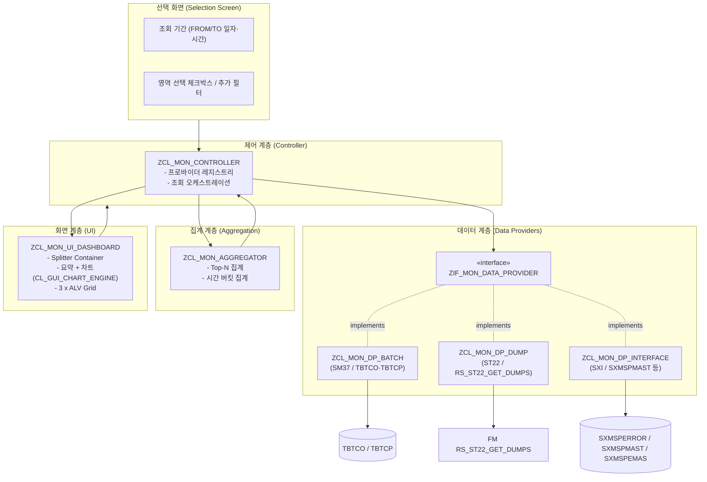
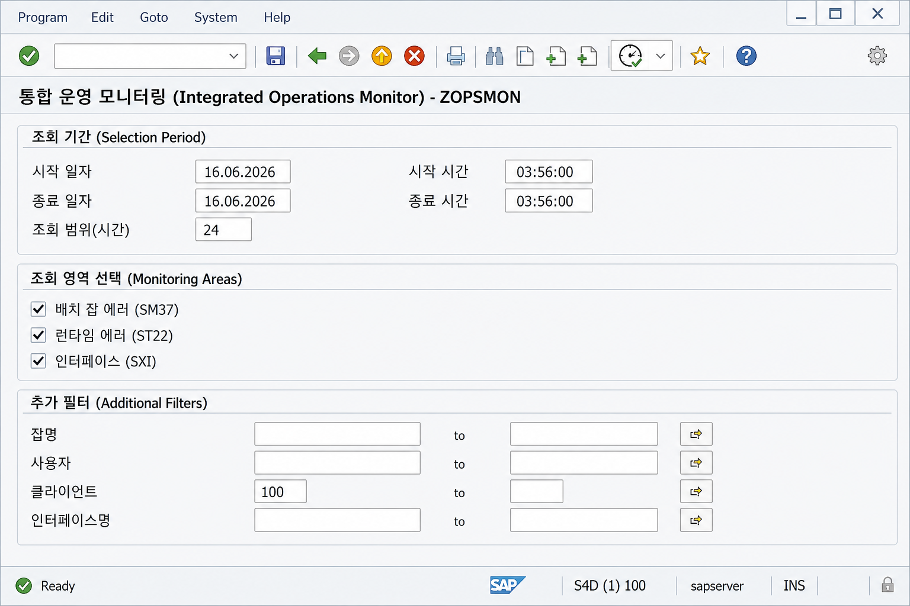
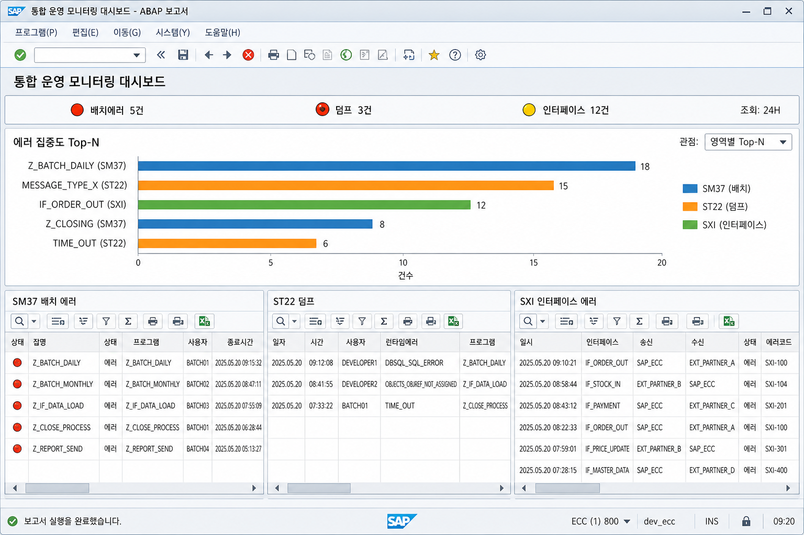
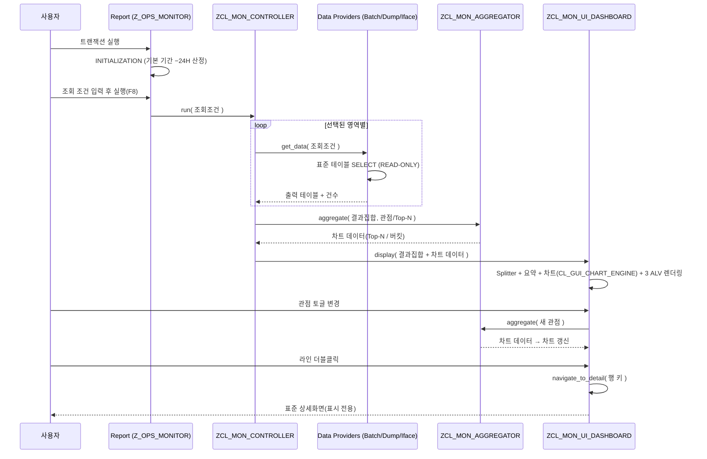

# 통합 운영 모니터링 프로그램 상세 설계서

| 항목 | 내용 |
|------|------|
| 문서명 | 통합 운영 모니터링 프로그램 (SM37 / ST22 / SXI_MONITOR) 상세 설계서 |
| 대상 시스템 | SAP S/4HANA (ABAP Integration Engine 사용) |
| 화면 환경 | SAP GUI (Classic Dynpro + OO ALV) |
| 문서 버전 | v0.4 (Draft) |
| 작성 목적 | ABAP 개발 착수 전 기능/데이터/화면/로직 확정을 위한 기술 설계 |
| 상태 | 검토 대기 (Review) |

> 본 문서는 **읽기 전용(Read-Only) 모니터링** 프로그램을 전제로 한다.
> 데이터 생성·수정·삭제 및 업데이트 트랜잭션 호출은 **전 영역에서 금지**한다.

---

## 목차

1. [개요](#1-개요)
2. [요구사항 정의](#2-요구사항-정의)
3. [전제 및 제약사항](#3-전제-및-제약사항)
4. [전체 아키텍처](#4-전체-아키텍처)
5. [데이터 소스 상세 설계](#5-데이터-소스-상세-설계)
6. [화면 설계](#6-화면-설계)
7. [처리 로직 설계](#7-처리-로직-설계)
8. [권한 및 보안 설계](#8-권한-및-보안-설계)
9. [성능 설계](#9-성능-설계)
10. [예외 및 에러 처리](#10-예외-및-에러-처리)
11. [개발 표준 및 오브젝트 목록](#11-개발-표준-및-오브젝트-목록)
12. [테스트 시나리오](#12-테스트-시나리오)
13. [향후 확장 방안](#13-향후-확장-방안)
14. [가정 및 미결 사항(Open Issues)](#14-가정-및-미결-사항open-issues)

---

## 1. 개요

### 1.1 목적
운영 담당자가 매일 수행하는 핵심 모니터링 업무를 **단일 프로그램(단일 트랜잭션)** 에서 통합 조회할 수 있도록 한다. 기존에는 다음 3개 표준 트랜잭션을 개별적으로 실행/조회해야 했다.

- **SM37** : 배치 잡(Background Job) 비정상 종료(에러) 모니터링
- **ST22** : ABAP 런타임 에러(Short Dump) 모니터링
- **SXI_MONITOR** : 인터페이스(PI/PO XML 메시지) 처리 에러 모니터링

본 프로그램은 위 3개 영역의 **에러 현황을 한 화면(대시보드)에서 동시에 가시화**하여, 운영 점검 시간을 단축하고 누락을 방지하는 것을 목적으로 한다.

### 1.2 범위
| 구분 | 포함(In-Scope) | 제외(Out-of-Scope) |
|------|----------------|--------------------|
| 기능 | 3개 영역의 에러 데이터 조회, 통합 대시보드 표시, 요약 카운트, 상세 드릴다운(표준 화면 호출) | 데이터 수정/재처리, 잡 재실행, 메시지 재전송, 알림/메일 발송 |
| 데이터 | 표준 테이블 직접 SELECT 및 표준 조회 FM | 커스텀(Z) 테이블, 외부 시스템 직접 연동 |
| 화면 | 단일 대시보드(3분할) + 선택 화면 | 웹/Fiori UI (본 단계는 SAP GUI 한정) |

### 1.3 대상 사용자
- 시스템 운영자 / 인프라 운영팀 / 인터페이스(PI) 운영 담당자

### 1.4 용어 정의
| 용어 | 설명 |
|------|------|
| 배치 잡 에러 | `TBTCO-STATUS = 'A'`(Cancelled/Aborted) 상태로 종료된 백그라운드 잡 |
| Short Dump | ABAP 런타임 에러로 인해 발생한 덤프(ST22에서 조회되는 항목) |
| 인터페이스 에러 | Integration Engine에서 처리 중 오류 상태로 종료된 XML 메시지 |
| 대시보드 | 3개 영역의 ALV를 한 화면에 분할 배치한 통합 조회 화면 |
| 데이터 프로바이더 | 각 모니터링 영역의 데이터를 조회하여 표준 출력 구조로 반환하는 모듈(클래스) |

---

## 2. 요구사항 정의

### 2.1 기능 요구사항(FR)
| ID | 요구사항 | 비고 |
|----|----------|------|
| FR-01 | 단일 프로그램에서 SM37/ST22/SXI 에러를 조회한다 | 단일 트랜잭션 코드 |
| FR-02 | 3개 영역을 하나의 대시보드 화면에 **동시 표시(3분할)** 한다 | 가시성 우선 |
| FR-03 | 화면 상단에 영역별 **에러 건수 요약 + 신호등 아이콘**을 표시한다 | 위험도 즉시 인지 |
| FR-04 | 조회 기간 기본값은 **현재시각 −24H ~ 현재시각** 으로 한다 | FR-05로 변경 가능 |
| FR-05 | 사용자가 조회 기간(일자/시간)을 **자유롭게 변경** 할 수 있다 | 월요일/명절 대응 |
| FR-06 | 각 라인 더블클릭 시 해당 표준 트랜잭션의 **상세 화면(읽기전용)** 으로 이동한다 | 드릴다운 |
| FR-07 | 영역별 조회 On/Off(체크박스)를 제공한다 | 부분 조회 |
| FR-08 | ALV 표준 기능(정렬/필터/합계/레이아웃 저장/엑셀 다운로드)을 지원한다 | 표준 ALV |

### 2.2 비기능 요구사항(NFR)
| ID | 요구사항 | 기준 |
|----|----------|------|
| NFR-01 | **읽기 전용** — 데이터 변경/업데이트/COMMIT/Enqueue 금지 | 필수 |
| NFR-02 | 표준 테이블/FM만 사용 | 필수 |
| NFR-03 | 기본 조회기간(24H) 응답 시간은 운영에 지장 없는 수준 | 인덱스 기반 조회 |
| NFR-04 | 향후 모니터링 영역 추가가 용이하도록 **모듈화(인터페이스 기반)** | 확장성 |
| NFR-05 | 권한 객체 기반 접근 통제 | 보안 |
| NFR-06 | 다국어 대응(텍스트 심볼/메시지 클래스 사용) | 국제화 |

---

## 3. 전제 및 제약사항

### 3.1 전제(Assumptions)
- 대상 시스템은 **S/4HANA** 이며, PI는 **ABAP Integration Engine(더블스택/내장 IE)** 을 사용하여 `SXMSPMAST` 등 PI 표준 테이블 접근이 가능하다.
- 배치 잡은 표준 `TBTCO`/`TBTCP` 테이블로 관리된다.
- ABAP 런타임 에러는 표준 `SNAP` 테이블에 저장된다.

### 3.2 제약사항(Constraints)
| 구분 | 제약 |
|------|------|
| 데이터 변경 금지 | `INSERT/UPDATE/MODIFY/DELETE`, `COMMIT WORK`, `ENQUEUE/DEQUEUE`, 업데이트성 BAPI/FM 호출 **전면 금지** |
| 트랜잭션 발생 금지 | 잡 재실행/메시지 재전송 등 **상태를 변경하는 행위 금지** |
| 표준 오브젝트만 | 데이터 원천은 표준 테이블/표준 조회 FM에 한정 |
| 드릴다운 | 상세 이동은 **표시(Display) 모드** 의 표준 화면/FM만 사용 |

> **읽기전용 보증 원칙**: 드릴다운으로 표준 트랜잭션을 호출하더라도, 호출 대상은 모니터링/조회용 화면이며 데이터 변경 기능을 트리거하지 않는다. (자세한 내용은 8장 참조)

---

## 4. 전체 아키텍처

### 4.1 설계 원칙
- **관심사 분리(Separation of Concerns)**: 데이터 조회 / 화면 표시 / 제어 로직을 분리한다.
- **인터페이스 기반 모듈화**: 영역별 데이터 조회를 공통 인터페이스로 추상화하여, **새로운 모니터링 영역 추가 시 신규 프로바이더 클래스만 구현** 하면 되도록 한다.
- **전략 패턴(Strategy)**: 컨트롤러는 등록된 데이터 프로바이더 목록을 순회하며 동일한 방식으로 호출한다.

### 4.2 논리 구성도



> 차트 데이터는 **신규 DB 조회 없이** 각 프로바이더가 이미 반환한 에러 행에서 `ZCL_MON_AGGREGATOR`가 파생 집계(Top-N / 시간 버킷)한다.

### 4.3 컴포넌트(클래스) 구성

| 컴포넌트 | 유형 | 책임 |
|----------|------|------|
| `ZIF_MON_DATA_PROVIDER` | Interface | 데이터 조회 표준 계약 정의 (`get_data`, `get_area_info`) |
| `ZCL_MON_DP_BATCH` | Class | SM37 배치 에러 조회 (`TBTCO`/`TBTCP`) |
| `ZCL_MON_DP_DUMP` | Class | ST22 덤프 조회 (FM `RS_ST22_GET_DUMPS`) |
| `ZCL_MON_DP_INTERFACE` | Class | SXI 인터페이스 에러 조회 (`SXMSPMAST` 외) |
| `ZCL_MON_CONTROLLER` | Class | 프로바이더 등록·실행, 결과 취합, 화면 연계 |
| `ZCL_MON_AGGREGATOR` | Class | 가져온 에러 행에서 차트용 집계(Top-N / 시간 버킷) 산출 |
| `ZCL_MON_UI_DASHBOARD` | Class | Splitter/ALV/차트 생성·이벤트 처리·드릴다운·관점 토글 |
| `ZCL_MON_NAVIGATOR` | Class | 영역별 표준 상세화면 호출(읽기전용) 캡슐화 |
| `Z_OPS_MONITOR` (Report) | Program | 선택화면 정의, INITIALIZATION, 컨트롤러 기동 |

> 초기 구현은 **하나의 실행형 리포트(`Z_OPS_MONITOR`)** 와 위 글로벌 클래스로 구성한다.
> 규모가 작을 경우 클래스를 리포트 내 로컬 클래스(LCL_*)로 둘 수도 있으나, **재사용·확장성을 위해 글로벌 클래스 권장**.

### 4.4 공통 인터페이스 계약(개념)

| 메서드 | 입력 | 출력 | 설명 |
|--------|------|------|------|
| `get_area_info` | - | 영역 코드/명/아이콘 | 요약 영역 표시에 사용 |
| `get_data` | 조회조건(기간/필터) | 표준 출력 테이블 + 건수 | 영역별 에러 데이터 반환 |
| `navigate_to_detail` | 선택 행 키 | - | 표준 상세화면(읽기전용) 호출 위임 |

> `navigate_to_detail`은 `ZCL_MON_NAVIGATOR`로 위임하여 화면 호출 로직을 일원화한다.

---

## 5. 데이터 소스 상세 설계

각 영역의 표준 데이터 원천, 조회 조건, 에러 판별 기준, 출력 구조를 정의한다.

### 5.1 SM37 — 배치 잡 에러

#### 5.1.1 사용 표준 테이블
| 테이블 | 설명 | 주요 사용 필드 |
|--------|------|----------------|
| `TBTCO` | 백그라운드 잡 헤더(상태 개요) | `JOBNAME`, `JOBCOUNT`, `STATUS`, `STRTDATE`, `STRTTIME`, `ENDDATE`, `ENDTIME`, `SDLUNAME`, `AUTHCKNAM` |
| `TBTCP` | 잡 스텝(실행 프로그램/변형) | `JOBNAME`, `JOBCOUNT`, `STEPCOUNT`, `PROGNAME`, `VARIANT`, `SDLUNAME` |

> `TBTCO`는 **클라이언트 독립적(Cross-Client)** 이다. (배치 잡은 클라이언트 무관 관리)

#### 5.1.2 에러 판별 기준
- `TBTCO-STATUS = 'A'` (Cancelled / Aborted) → **비정상 종료 = 에러**

| STATUS | 의미 | 에러 대상 |
|--------|------|-----------|
| `A` | Cancelled(취소/비정상 종료) | ✅ |
| `F` | Finished(정상 완료) | ❌ |
| `R` | Active(실행 중) | ❌ |
| `S` | Released(릴리즈됨) | ❌ |
| `P` | Scheduled(스케줄됨) | ❌ |
| `Y` | Ready(준비됨) | ❌ |

> 기본은 `A`만 조회한다. (확장 옵션으로 "전체 상태 보기" 제공 가능 — 13장 참조)

#### 5.1.3 조회 조건  ✅ 확정(O-1)
- 기간: **`ENDDATE` / `ENDTIME`(종료시각) 기준** 으로 조회한다. (취소된 잡의 종료시각 = 실패 시점)
- 필터(옵션): 잡명(`JOBNAME`), 사용자(`SDLUNAME`).

#### 5.1.4 출력 구조 (`ZMON_S_BATCH` 개념)
| 필드 | 출처 | 설명 |
|------|------|------|
| `ICON` | (산출) | 신호등 아이콘(에러=적색) |
| `JOBNAME` | TBTCO | 잡 이름 |
| `JOBCOUNT` | TBTCO | 잡 카운트(키) |
| `STATUS` / `STATUS_TX` | TBTCO | 상태 코드/텍스트 |
| `PROGNAME` | TBTCP | 실행 프로그램(대표 스텝) |
| `SDLUNAME` | TBTCO | 스케줄/실행 사용자 |
| `STRTDATE`/`STRTTIME` | TBTCO | 시작 일자/시간 |
| `ENDDATE`/`ENDTIME` | TBTCO | 종료 일자/시간 |

#### 5.1.5 조회 방식 옵션
- (A) `TBTCO` 직접 SELECT + 필요 시 `TBTCP` 조인/조회. — 성능·단순성 우수, **권장**
- (B) 표준 FM `BP_JOB_SELECT` 사용. — 표준 로직 재사용, 단 출력 구조 가공 필요

#### 5.1.6 드릴다운(읽기전용)  ✅ 확정(O-2)
- 잡 로그 표시 FM **`BP_JOBLOG_SHOW`**(잡명/잡카운트 전달)로 로그를 표시한다. (FM 존재 확인됨)
- 필요 시 **`BP_JOBLOG_READ`**(로그 읽기)도 함께 사용 가능. 두 FM 호출은 `ZCL_MON_NAVIGATOR`에 캡슐화한다.

---

### 5.2 ST22 — ABAP 런타임 에러(Short Dump)

#### 5.2.1 사용 표준 FM  ✅ 확정(O-3 갱신 / O-11)
| 오브젝트 | 유형 | 설명 |
|----------|------|------|
| `RS_ST22_GET_DUMPS` | FM | 덤프 목록을 정형 구조로 반환 (EXPORT `P_INFOTAB` TYPE `RSDUMPTAB`) |

> ⚠️ **결정 변경**: `SNAP` 테이블에는 런타임 에러 유형/프로그램이 **정식 필드로 존재하지 않고 압축 영역(`FLIST`~`FLIST05`)에 인코딩**되어 있음을 확인하여, **`SNAP` 직접 SELECT 대신 표준 FM `RS_ST22_GET_DUMPS`** 로 조회한다. (검증 완료: FM 존재, EXPORT = `RSDUMPTAB`)

#### 5.2.2 에러 판별 기준
- `RS_ST22_GET_DUMPS`가 반환하는 덤프 = 런타임 에러 → 기간 내 반환 항목 전체가 조회 대상.

#### 5.2.3 조회 조건  ✅ 확정(O-11)
- import 파라미터가 **덤프 날짜(단일)** 이므로 → **조회기간 내 날짜별로 FM 반복 호출** 후, 반환 항목의 `SYTIME`을 선택화면 **시간 범위로 ABAP 필터링**한다. (자정 경계·72H 케이스 대응)
- 필터(옵션): 사용자(`SYUSER`), 서버(`SYHOST`)는 반환 후 ABAP 필터.
- `RSDUMPTAB`에 `MANDT`가 없어 ST22는 **클라이언트 컬럼 제외**(FM이 시스템 컨텍스트로 처리).

#### 5.2.4 출력 구조 (`ZMON_S_DUMP` ← `RSDUMPTAB`)  ✅ 확정(O-11)
| ALV 필드 | RSDUMPTAB 필드 | 설명 |
|----------|----------------|------|
| `ICON` | (산출) | 신호등 아이콘(적색) |
| `DATUM` | `SYDATE` | 발생 일자 |
| `UZEIT` | `SYTIME` | 발생 시간 |
| `UNAME` | `SYUSER` | 사용자 |
| `AHOST` | `SYHOST` | 애플리케이션 서버 |
| **`RT_ERROR`** | **`DUMPID`** | **런타임 에러 유형**(예: `MESSAGE_TYPE_X`) ← 차트 Top-N 키 |
| `PROGNAME` | `PROGRAMNAME` | 발생 프로그램 |
| `INCLUDE` | `INCLUDENAME` | 인클루드 |
| `LINE` | `LINENUMBER` | 소스 라인 |

#### 5.2.5 드릴다운(읽기전용)  ✅ 확정(O-3)
- **`CALL TRANSACTION 'ST22'`** (표시 모드)로 표준 덤프 상세 화면을 호출한다. (읽기전용 진입, `ZCL_MON_NAVIGATOR`에 캡슐화)

---

### 5.3 SXI_MONITOR — 인터페이스(XML 메시지) 에러

#### 5.3.1 사용 표준 테이블  ✅ 확정(O-4)
| 테이블 | 설명 | 확인된/사용 필드 |
|--------|------|------------------|
| `SXMSPERROR` | **에러 정보(에러 판별·기간 필터의 기점)** | `MSGGUID`, `PID`, `ERRSTAT`(에러 상태), `EXETIMEST`(실행 시각) |
| `SXMSPMAST` | XML 메시지 마스터(헤더) | `MSGGUID`, `PID`, `MSGSTATE`, `ITFACTION`, `EXETIMEST`, `INITTIMEST`, `SENDTIMEST` |
| `SXMSPEMAS` | 확장 마스터(상세/송수신 정보) | `OB_SYSTEM`(송신), `IB_SYSTEM`(수신), `OB_NAME`/`OB_NS`(송신 IF/NS), `IB_NAME`/`IB_NS`(수신 IF/NS), `OB_OPERATION`, `OB_PARTY`/`IB_PARTY` |

> ⚠️ **`EXEPIPELINE` 필드는 미존재** 확인됨 → 설계에서 제거. 파이프라인 식별은 `PID`/`ITFACTION` 사용.
> 위 테이블은 **클라이언트 종속(MANDT)** 이며 ABAP Integration Engine 환경에서 유효하다.

#### 5.3.2 에러 판별 기준  ✅ 확정(O-4) — 방식 A
- **`SXMSPERROR`에 에러 레코드가 존재하는 메시지를 에러로 간주**한다.
- 조회 효율을 위해 **`SXMSPERROR`를 기간(`EXETIMEST`)으로 먼저 SELECT** 한 뒤, `MSGGUID`(+`PID`)로 `SXMSPMAST`/`SXMSPEMAS`를 조인하여 상세를 채운다.

#### 5.3.3 조회 조건  ✅ 확정(O-4)
- 기간: **`EXETIMEST`(실행 시각) 기준**. 선택화면의 로컬 일자/시간을 **긴 형식(Long) UTC 타임스탬프로 변환**하여 비교한다. (7.2 / 7.3 참조)
- 필터(옵션): 인터페이스명(`SO_IFACE` → `OB_NAME`), 클라이언트(`P_MAND`).

#### 5.3.4 출력 구조 (`ZMON_S_IFACE`)  ✅ 확정(O-10)
| ALV 필드 | 출처 필드 | 설명 |
|----------|-----------|------|
| `ICON` | (산출) | 신호등 아이콘(적색) |
| `EXE_DATE`/`EXE_TIME` | `SXMSPERROR-EXETIMEST` 변환 | 실행(에러) 일시(UTC→로컬 환산 표시) |
| **`IF_NAME`** | **`SXMSPEMAS-OB_NAME`** | 인터페이스명(송신) ← 차트 Top-N 키 |
| `IF_NS` | `SXMSPEMAS-OB_NS` | 네임스페이스(기본 숨김/툴팁) |
| `OPERATION` | `SXMSPEMAS-OB_OPERATION` | 서비스 인터페이스 오퍼레이션 |
| `SENDER` | `SXMSPEMAS-OB_SYSTEM` | 송신 시스템 (B2B 시 `OB_PARTY` 보조) |
| `RECEIVER` | `SXMSPEMAS-IB_SYSTEM` | 수신 시스템 (B2B 시 `IB_PARTY` 보조) |
| `MSGSTATE` / `STATE_TX` | `SXMSPMAST-MSGSTATE` | 메시지 상태/텍스트 |
| `ERRSTAT` | `SXMSPERROR-ERRSTAT` | 에러 상태/카테고리 |
| `MSGGUID` | `SXMSPMAST-MSGGUID` | 메시지 GUID(드릴다운 키, 숨김 가능) |

> 방향(Inbound/Outbound) 전용 필드는 `SXMSPEMAS`에 없으므로 **별도 방향 컬럼은 두지 않고 "송신(OB)→수신(IB)" 흐름**으로 표현한다.

#### 5.3.5 드릴다운(읽기전용)  ✅ 확정(O-4)
- **`CALL TRANSACTION 'SXI_MONITOR'`** 로 표준 메시지 모니터를 표시 모드로 호출한다. (`ZCL_MON_NAVIGATOR`에 캡슐화)

---

## 6. 화면 설계

### 6.1 선택 화면(Selection Screen)

```
┌─ 조회 기간 ────────────────────────────────────────────────┐
│  시작 일자  [P_FRDAT]   시작 시간 [P_FRTIM]                  │
│  종료 일자  [P_TODAT]   종료 시간 [P_TOTIM]                  │
│  (편의) 조회 범위(시간) [P_HOURS] 기본 24  ← 클릭 시 기간 재계산 │
├─ 조회 영역 선택 ──────────────────────────────────────────┤
│  [X] 배치 잡 에러(SM37)  [X] 런타임 에러(ST22)  [X] 인터페이스(SXI) │
├─ 추가 필터(옵션) ─────────────────────────────────────────┤
│  잡명 [SO_JOB]   사용자 [SO_USER]   클라이언트 [P_MAND]       │
│  인터페이스명 [SO_IFACE]                                     │
├─ 표시 옵션 ───────────────────────────────────────────────┤
│  영역별 최대 표시 행수 [P_MAXROW] 기본 250                    │
│  차트 Top-N [P_TOPN] 기본 5                                  │
└────────────────────────────────────────────────────────────┘
```

| 화면 필드 | 타입 | 기본값 | 설명 |
|-----------|------|--------|------|
| `P_FRDAT` / `P_FRTIM` | D / T | 현재시각 −24H | 조회 시작 일자/시간 |
| `P_TODAT` / `P_TOTIM` | D / T | 현재시각 | 조회 종료 일자/시간 |
| `P_HOURS` | I | 24 | 편의용 조회 시간(H). 변경 시 FROM/TO 자동 재계산(7.2 참조) |
| `CB_SM37` / `CB_ST22` / `CB_SXI` | C(체크박스) | 'X' | 조회 영역 On/Off |
| `SO_JOB` | Select-Option | - | 잡명 필터(SM37) |
| `SO_USER` | Select-Option | - | 사용자 필터(SM37/ST22) |
| `P_MAND` | MANDT | `SY-MANDT` | 클라이언트 필터(ST22/SXI) |
| `SO_IFACE` | Select-Option | - | 인터페이스명 필터(SXI) |
| `P_TOPN` | I | 5 | 차트 Top-N 개수(영역별 집중도 차트) |
| `P_MAXROW` | I | 250 | 영역별 ALV 최대 표시 행수(O-8). 최신순 제한, 초과 시 안내 |

> **월요일/명절 대응**: 기본 24H로 두되, `P_HOURS`를 72 등으로 늘리거나 `P_FRDAT/P_FRTIM`을 직접 수정하여 조회 범위를 확장할 수 있다.
> **결과 건수 상한(O-8)**: 조회는 기간 내 **전건** 수행하되 ALV 표시는 영역별 `P_MAXROW`(기본 250)건으로 **최신순 제한**하고 "상위 N건만 표시(전체 X건)" 안내를 표시한다. **차트 집계(Top-N/추이)는 표시 제한과 무관하게 전체 건수 기준**으로 산출한다.

**화면 목업 (선택 화면)**



> 위 이미지는 설계 기준의 SAP GUI 선택 화면 예시이며, 실제 필드 배치/레이블은 빌드 단계에서 조정될 수 있다.

### 6.2 대시보드 레이아웃 (Screen 0100)  ✅ 확정(O-5)

`CL_GUI_DOCKING_CONTAINER`(또는 Custom Control) 위에 `CL_GUI_SPLITTER_CONTAINER`를 배치하여 **상단 요약 + 차트 패널 + 하단 3분할 ALV** 의 3단 구조로 구성한다.

```
┌──────────────────────────────────────────────────────────────────────┐
│ [요약]  🔴 배치에러 5건   🔴 덤프 3건   🟡 인터페이스 12건   조회:24H   │  ← ① 신호등 요약(얇게)
├──────────────────────────────────────────────────────────────────────┤
│ [차트] 에러 집중도 Top-N            관점: [영역별 Top-N ▼]              │  ← ② 관점 선택형 차트
│   Z_BATCH_DAILY (SM37) ████████ 12                                     │
│   MESSAGE_TYPE_X (ST22) █████ 7                                         │
│   IF_ORDER_OUT  (SXI)   ████ 5      ...                                 │
├───────────────────┬───────────────────┬──────────────────────────────┤
│  ▣ SM37 배치 에러   │  ▣ ST22 덤프        │  ▣ SXI 인터페이스 에러         │  ← ③ 3분할 ALV
│  ALV Grid #1       │  ALV Grid #2        │  ALV Grid #3                  │
│  (TBTCO/TBTCP)     │  (RS_ST22_GET_DUMPS)│  (SXMSPERROR 외)              │
│  ⇧더블클릭→잡로그    │  ⇧더블클릭→덤프상세  │  ⇧더블클릭→메시지상세           │
└───────────────────┴───────────────────┴──────────────────────────────┘
```

- **레이아웃 구조**: `CL_GUI_SPLITTER_CONTAINER`로 세로 3단(요약/차트/ALV) 구성. ALV 영역은 다시 세로 3분할(좌/중/우).
- 각 ALV 상단에 영역 제목과 건수를 표시하고, 분할 경계는 드래그로 비율 조정 가능.
- 차트 영역 높이도 분할바로 조정 가능(관심 시 차트를 키우거나 ALV를 키움).

**화면 목업 (대시보드 — 차트 포함)**



> 상단 신호등 요약 + 관점 선택형 차트(기본: 영역별 Top-N) + 3분할 ALV 구성. 컬럼/표시 항목은 6.4 필드 카탈로그를 따른다.

### 6.2a 차트 패널 설계 (관점 선택형)  ✅ 확정(O-5)

- **렌더링 기술**: `CL_GUI_CHART_ENGINE`(IGS 기반). **IGS 가용 확인됨**(O-9 해소).
- **차트 데이터**: 신규 DB 조회 없이 각 프로바이더가 반환한 **에러 행에서 `ZCL_MON_AGGREGATOR`가 파생 집계**.
- **관점(Perspective) 토글** — 차트 패널 우측 상단 드롭다운으로 전환:

| 관점 | 차트 유형 | 집계 내용 | 기본 |
|------|-----------|-----------|------|
| **영역별 Top-N 집중도** | 가로 막대(Pareto) | 영역별 상위 N개 반복 원인을 영역 색상으로 구분 표시 | ✅ 기본값 |
| 시간대별 추이 | 누적 막대(Stacked Column) | 조회기간을 **적응형 버킷**으로 나눠 시간대별 영역별 건수 | 토글 |

- **Top-N 기준 키(영역별)**  ✅ 확정:

| 영역 | Top-N 기준 키 |
|------|---------------|
| SM37 | `JOBNAME`(잡명) |
| ST22 | `DUMPID`(런타임 에러 유형) |
| SXI | `OB_NAME`(송신 인터페이스명) |

- **집계 단위 = 영역별 독립 Top-N**(O-8): 각 영역이 **자기 Top-N**을 가지므로, 영역 간 **에러 건수 스케일 차이가 커도**(예: SXI 수백 vs SM37 수 건) 작은 영역이 묻히지 않는다.
- **집계 기준 = 전체 건수**(O-8): ALV 표시 상한(`P_MAXROW`)과 **무관하게 기간 내 전건**으로 집계한다.
- **N 값**: 기본 **5**, 선택화면 파라미터 `P_TOPN`으로 변경 가능.
- **적응형 버킷(시간대별 추이)**: 조회 범위에 따라 버킷 크기 자동 결정 — 예) ≤ 24H → 1시간, ≤ 7일 → 1일, 그 이상 → 적절 단위. (가변 조회기간 대응)
- **스케일 유의(시간대별 추이)**: 한 영역이 절대 건수로 압도할 수 있으므로 **영역 고정 색상 + 범례**로 명확히 구분하고, 절대 막대 높이만으로 오인하지 않도록 한다. (필요 시 "특정 영역만 보기" 토글은 확장 옵션)
- **색상 규약**: SM37 / ST22 / SXI 각각 고정 색상을 부여하여 차트·범례 일관성 유지.

### 6.3 요약 영역 설계  ✅ 확정(O-6)
- 상단 요약 줄에 영역별 **건수 + 신호등 아이콘(3단계)** 을 표시한다.
- 신호등은 **영역별 건수 기반**으로 판정하며, 임계값은 **클래스 상수**로 정의(선택화면 비노출, 유지보수 시 조정).

| 영역 | 🟢 녹색 | 🟡 황색 | 🔴 적색 | 비고 |
|------|---------|---------|---------|------|
| SM37 (배치 에러) | 0 | — | **≥ 1** | 황색 구간 없음 — 1건이라도 즉시 적색 |
| ST22 (덤프) | 0 | 1 ~ 30 | **≥ 31** | |
| SXI (인터페이스) | 0 | 1 ~ 50 | **≥ 51** | |

- 아이콘: 🟢 `ICON_GREEN_LIGHT` / 🟡 `ICON_YELLOW_LIGHT` / 🔴 `ICON_RED_LIGHT`.
- 임계 상수(예): `C_SM37_RED=1`, `C_ST22_YEL=1 / C_ST22_RED=31`, `C_SXI_YEL=1 / C_SXI_RED=51`.

### 6.4 ALV 필드 카탈로그(요약)

#### 6.4.1 SM37 ALV
`ICON` / `JOBNAME` / `JOBCOUNT` / `STATUS_TX` / `PROGNAME` / `SDLUNAME` / `STRTDATE` / `STRTTIME` / `ENDDATE` / `ENDTIME`

#### 6.4.2 ST22 ALV  (← `RSDUMPTAB`)
`ICON` / `DATUM`(SYDATE) / `UZEIT`(SYTIME) / `UNAME`(SYUSER) / `AHOST`(SYHOST) / `RT_ERROR`(DUMPID) / `PROGNAME`(PROGRAMNAME) / `INCLUDE`(INCLUDENAME) / `LINE`(LINENUMBER)
> `RSDUMPTAB`에 `MANDT` 없음 → 클라이언트 컬럼 제외.

#### 6.4.3 SXI ALV
`ICON` / `EXE_DATE` / `EXE_TIME` / `IF_NAME`(OB_NAME) / `OPERATION`(OB_OPERATION) / `SENDER`(OB_SYSTEM) / `RECEIVER`(IB_SYSTEM) / `MSGSTATE`(STATE_TX) / `ERRSTAT` / `MSGGUID`(숨김 가능)
> 시각 컬럼은 `EXETIMEST`(UTC)를 로컬로 환산해 표시. 방향 컬럼 없음(송신→수신 흐름으로 표현).

> 공통: 정렬/필터/합계/레이아웃 저장/엑셀 다운로드 등 ALV 표준 기능 활성화. 컬럼 폭/순서는 빌드 시 필드카탈로그에서 조정.

### 6.5 드릴다운(이벤트) 매핑
| 영역 | 이벤트 | 처리 | 호출 대상(읽기전용) |
|------|--------|------|----------------------|
| SM37 | `double_click` | 선택 행의 `JOBNAME`/`JOBCOUNT` 전달 | 잡 로그 표시 |
| ST22 | `double_click` | 선택 행의 덤프 키 전달 | 덤프 상세 표시 |
| SXI | `double_click` | 선택 행의 `MSGGUID` 전달 | 메시지 상세 표시 |

> 모든 드릴다운은 `ZCL_MON_NAVIGATOR`를 경유하여 **표시 모드** 로만 호출한다.

---

## 7. 처리 로직 설계

### 7.1 전체 처리 흐름



### 7.2 기본 조회기간 산정 로직 (FR-04 / FR-05)

`INITIALIZATION` 시점에 **현재시각 −24H ~ 현재시각** 을 계산하여 선택화면 기본값으로 설정한다.

의사코드:

```abap
" 현재 시각
DATA(lv_to_stamp) = 현재 타임스탬프( SY-DATUM, SY-UZEIT ).
" 24시간(또는 P_HOURS) 이전
DATA(lv_from_stamp) = lv_to_stamp - ( P_HOURS * 3600 ).

" 타임스탬프 → 일자/시간 분리
P_TODAT = SY-DATUM. P_TOTIM = SY-UZEIT.
분리( lv_from_stamp ) → P_FRDAT, P_FRTIM.
```

- 표준 변환은 `CL_ABAP_TSTMP` 또는 시간 연산(`CL_ABAP_TSTMP=>add/subtractsecs`)을 사용한다.
- `P_HOURS` 변경 시(`AT SELECTION-SCREEN`) FROM/TO를 재계산하여 화면에 반영(편의 기능).
- 사용자가 `P_FRDAT/P_FRTIM/P_TODAT/P_TOTIM`을 직접 수정하면 그 값을 우선한다. (월요일/명절 대응)

> **일자+시간 경계 처리 주의**: 조회 기간이 일자 경계(자정)를 넘는 경우(예: 어제 14:00 ~ 오늘 14:00), 단순 `DATUM BETWEEN`만으로는 시간 경계가 누락/초과될 수 있다. → 각 프로바이더는 **(일자, 시간) 복합 조건** 또는 타임스탬프 비교로 정확히 필터링한다. (7.3 참조)

### 7.3 기간 필터 적용 규칙(영역별)  ✅ 확정 반영
| 영역 | 기준 필드 | 필터 방식 |
|------|-----------|-----------|
| SM37 | `TBTCO-ENDDATE` + `ENDTIME`(종료시각, O-1) | 복합조건: 시작일=종료일이면 시간 BETWEEN, 다중일이면 경계일만 시간 비교 |
| ST22 | `RS_ST22_GET_DUMPS` 반환 `SYDATE`+`SYTIME` | 날짜별 FM 호출 후 `SYTIME`을 시간범위로 ABAP 필터 |
| SXI | `SXMSPERROR-EXETIMEST`(UTC 타임스탬프, O-4) | **로컬 FROM/TO → 긴 형식 UTC 타임스탬프 변환 후** 직접 비교 |

- 공통 유틸 메서드 `build_datetime_range( )`로 (FROM일/시, TO일/시) → 일자/시간 기반 WHERE/RANGE 생성 로직을 **단일화**(SM37/ST22).
- SXI는 별도 유틸 `convert_local_to_utc_tstmp( )`로 로컬 일자/시간을 **긴 형식 UTC 타임스탬프(`TIMESTAMPL` 등)** 로 변환 후 `EXETIMEST` 범위 비교. (시스템/사용자 타임존 기준 변환은 `CL_ABAP_TSTMP` / 표준 변환 사용)

> **타임존 주의**: `*TIMEST` 계열은 UTC 기준이므로 화면 입력(로컬)과 직접 비교하면 안 되며, 반드시 변환 후 비교한다. 표시(ALV)에서는 UTC → 로컬 환산하여 보여준다.

### 7.4 모듈화/확장 포인트
- 신규 영역(예: SM21 시스템 로그, AL08, RZ20) 추가 시: `ZIF_MON_DATA_PROVIDER`를 구현한 **신규 프로바이더 클래스만 작성**하고 컨트롤러 레지스트리에 등록 → 화면/요약은 공통 로직이 자동 처리.
- 화면 분할 수/레이아웃은 등록된 프로바이더 수에 따라 동적으로 구성하는 것을 목표로 한다(초기엔 3분할 고정, 확장 시 동적화 — 13장).

---

## 8. 권한 및 보안 설계

### 8.1 읽기 전용 보증(필수)
- 모든 데이터 접근은 `SELECT` 또는 **조회용 표준 FM** 으로 한정한다.
- 다음을 **코드 레벨에서 금지**한다: `INSERT/UPDATE/MODIFY/DELETE`, `COMMIT WORK`, `ROLLBACK`(업무 목적), `ENQUEUE_*`/`DEQUEUE_*`, 업데이트 태스크(`CALL FUNCTION ... IN UPDATE TASK`), 상태 변경성 BAPI/FM(잡 재실행·메시지 재전송 등).
- 드릴다운 호출 대상은 **표시(Display) 화면/FM** 으로 제한한다.

### 8.2 권한 체크 설계  ✅ 확정(O-7, STAUTHTRACE 검증 완료)
- **방식 = (A) 영역별 권한 체크**. 각 영역 조회 직전 `AUTHORITY-CHECK` 수행.
- **권한 없는 영역은 해당 영역만 스킵**(ALV 비움 + "권한 없음" 안내), **나머지 영역은 정상 조회**.
- 객체/필드/값은 대상 시스템 **STAUTHTRACE 런타임 추적으로 확정**하였다. (아래 표)

| 영역 | 권한 객체(확정) | 점검 필드 / 값 | 비고 |
|------|-----------------|----------------|------|
| SM37(배치) | `S_BTCH_JOB` | `JOBGROUP='*'`, `JOBACTION='SHOW'` | 최소권한(표시). 관리자는 `S_BTCH_ADM='Y'`로도 통과하나 게이트는 `S_BTCH_JOB`로 통일 |
| ST22(덤프) | `S_ABAPDUMP` | `ACTVT='03'`, `DUMP_INFO='FULL'`, `DUMP_CCLNT='ALL'`, `DUMP_CUSER='ALL'` | 전 클라이언트·전 사용자 덤프 조회(표시). 후보였던 `S_ADMI_FCD`는 오판정으로 **제거** |
| SXI(인터페이스) | `S_XMB_MONI` | `ACTVT='03'` (기타 필드 `SXMBPARTY/…/SXMBIFNAME` = `*`) | 모니터 표시. `S_XMB_ADM`(관리자)은 **미요구** |

> **정정(O-7)**: STAUTHTRACE 결과 ST22의 실제 체크 객체는 `S_ABAPDUMP`(`CL_DUMP_AUTHORIZATION`)이며, 설계 후보였던 `S_ADMI_FCD`는 ST22와 무관(추적 상 `S_ADMI_FCD=ST0M`은 STAUTHTRACE 자신의 체크)함을 확인하여 교체하였다.
> `S_TCODE`, `S_GUI`(ACTVT 61), `S_ALV_LAYO`(ACTVT 23)는 프레임워크/드릴다운(`CALL TRANSACTION`)이 자동 체크하므로 본 프로그램에서 명시적 `AUTHORITY-CHECK` 대상으로 두지 않는다.

### 8.3 트랜잭션 코드
- 단일 트랜잭션 코드(예: `ZOPSMON`)를 생성하고, 적절한 권한 그룹/메뉴에 배치한다.

---

## 9. 성능 설계
- **기간 제한 필수**: 모든 조회는 조회기간(기본 24H)으로 제한하여 풀스캔을 방지한다.
- **인덱스/조회 효율**:
  - `TBTCO`: 상태(`STATUS='A'`)/종료일자 기반 조회. 가능한 표준 인덱스를 활용.
  - ST22: `RS_ST22_GET_DUMPS`를 **날짜별 호출**(기간 일수만큼). 조회기간이 길면 호출 횟수가 늘어나므로 기간 제한 권장.
  - `SXMSPERROR`: `EXETIMEST`(UTC) 범위로 먼저 SELECT 후 `MSGGUID`(+`PID`)로 조인 → 에러 메시지만 정밀 조회.
- **필요 컬럼만 SELECT**(`SELECT` 필드 명시), 불필요한 `SELECT *` 지양.
- **영역별 독립 조회**: 한 영역이 느려도 다른 영역 표시에 영향 최소화(개별 예외 처리).
- **결과 상한(O-8)**: 조회는 전건, **ALV 표시는 `P_MAXROW`(기본 250) 최신순 제한**. 차트 집계는 전체 기준.

---

## 10. 예외 및 에러 처리
| 상황 | 처리 |
|------|------|
| 특정 영역 조회 실패(권한/데이터 없음) | 해당 ALV는 비우고 요약에 상태 표시, 나머지 영역은 정상 표시 |
| 조회 기간 미입력/역전(FROM>TO) | 선택화면 검증(`AT SELECTION-SCREEN`)에서 오류 메시지 |
| 데이터 0건 | "조회된 에러 없음" 안내 + 녹색 신호등 |
| FM 호출 실패(예외) | `TRY/CATCH`로 포착, 사용자에게 영역 단위 메시지 |

> 모든 사용자 메시지는 **메시지 클래스(예: `ZOPSMON`)** 로 관리하여 다국어 대응한다.

---

## 11. 개발 표준 및 오브젝트 목록

### 11.1 명명 규칙
- 네임스페이스: `Z`(또는 고객 표준 네임스페이스).
- 변수 프리픽스: 지역 `l*`, 전역 `g*`, 임포팅 `i*`/`im_`, 익스포팅 `e*`/`ex_`, 멤버 `m*` 등 고객 ABAP 코딩 가이드 준수.

### 11.2 오브젝트 목록(초안)
| 오브젝트 | 유형 | 설명 |
|----------|------|------|
| `Z_OPS_MONITOR` | Program(Report) | 메인 리포트(선택화면/기동) |
| `ZOPSMON` | Transaction | 실행 트랜잭션 코드 |
| `ZOPSMON` | Message Class | 사용자 메시지 |
| `ZIF_MON_DATA_PROVIDER` | Interface | 데이터 프로바이더 계약 |
| `ZCL_MON_DP_BATCH` | Class | SM37 프로바이더 |
| `ZCL_MON_DP_DUMP` | Class | ST22 프로바이더 |
| `ZCL_MON_DP_INTERFACE` | Class | SXI 프로바이더 |
| `ZCL_MON_CONTROLLER` | Class | 컨트롤러 |
| `ZCL_MON_AGGREGATOR` | Class | 차트용 집계(Top-N / 시간 버킷) |
| `ZCL_MON_UI_DASHBOARD` | Class | 대시보드 UI(요약/차트/3 ALV) |
| `ZCL_MON_NAVIGATOR` | Class | 드릴다운 네비게이터 |
| `ZMON_S_BATCH` / `ZMON_S_DUMP` / `ZMON_S_IFACE` / `ZMON_S_SUMMARY` / `ZMON_S_CHART` | Structure | 출력/차트 구조 |
| `ZMON_T_*` | Table Type | 출력 테이블 타입 |
| Dynpro `0100` | Screen | 대시보드 화면(Custom Control 포함) |

> 차트는 `CL_GUI_CHART_ENGINE`(IGS) 사용. 차트 데이터 XML(또는 데이터/커스터마이징)은 `ZCL_MON_UI_DASHBOARD`/`ZCL_MON_AGGREGATOR`에서 구성한다.

> DDIC 구조(`ZMON_S_*`)는 표준 테이블 필드를 기반으로 정의한다.

---

## 12. 테스트 시나리오
| ID | 시나리오 | 기대 결과 |
|----|----------|-----------|
| TC-01 | 기본(24H) 조회 | 3영역 ALV + 요약 정상 표시 |
| TC-02 | `P_HOURS=72`(월요일 대응) | FROM이 72H 전으로 재계산되어 조회 |
| TC-03 | 기간 직접 수정(자정 경계 포함) | 시간 경계까지 정확히 필터링 |
| TC-04 | 특정 영역 체크 해제 | 해당 ALV 미표시, 나머지 정상 |
| TC-05 | 에러 0건 영역 | 녹색 신호등 + "에러 없음" |
| TC-06 | 라인 더블클릭(각 영역) | 표준 상세화면(표시 전용) 진입 |
| TC-07 | 권한 없는 영역 | 안내 메시지, 타 영역 정상 |
| TC-08 | FROM>TO 입력 | 검증 오류 메시지 |
| TC-09 | 대량 데이터 기간 | 응답 시간/메모리 확인, 풀스캔 미발생 |
| TC-10 | 읽기전용 검증 | 변경/COMMIT/Enqueue 미발생(코드 검수) |
| TC-11 | 차트 기본 표시(영역별 Top-N) | 상위 N개 원인이 영역 색상으로 정상 표시 |
| TC-12 | 차트 관점 토글(시간대별 추이) | 적응형 버킷으로 추이 차트 재렌더링 |
| TC-13 | `P_TOPN` 변경 | Top-N 막대 개수 반영 |
| TC-14 | SXI 타임존 변환 | 로컬→UTC 변환 후 정확히 조회, 표시값 로컬 환산 확인 |

---

## 13. 향후 확장 방안
- 모니터링 영역 추가: SM21(시스템 로그), AL08, RZ20(CCMS), gateway/ICM 모니터 등 → 프로바이더 추가만으로 확장.
- 화면 동적 분할: 등록 프로바이더 수에 따라 ALV 개수/배치 자동 구성.
- 자동 새로고침(타이머) 및 임계치 기반 시각 강조.
- 알림(이메일/메신저) 발송 — *현재 범위 외(읽기전용 원칙과 별개로 운영 정책 검토 필요)*.
- 즐겨찾기/사용자별 기본 조회조건 저장(파라미터 ID / 변형 활용).
- Fiori/UI5 버전으로의 확장(데이터 계층 재사용).

---

## 14. 가정 및 미결 사항(Open Issues)

### 14.1 확정된 항목 (Resolved)
| ID | 항목 | 확정 내용 |
|----|------|-----------|
| ✅ O-1 | SM37 기간 기준 | **종료시각(`ENDDATE`/`ENDTIME`) 기준** |
| ✅ O-2 | SM37 드릴다운 | **`BP_JOBLOG_SHOW`**(+`BP_JOBLOG_READ`), 네비게이터 캡슐화 (FM 존재 확인) |
| ✅ O-3 | ST22 조회/표시 | 조회=**`RS_ST22_GET_DUMPS`**(SNAP에 정식 필드 부재로 변경), 표시=**`CALL TRANSACTION 'ST22'`** |
| ✅ O-4 | SXI 조회/판별 | 판별=**`SXMSPERROR` 에러레코드 존재(방식 A)**, 기간=**`EXETIMEST`(로컬→UTC 변환)**, `SXMSPERROR`→`SXMSPMAST`/`SXMSPEMAS` `MSGGUID`(+`PID`) 조인, 표시=**`CALL TRANSACTION 'SXI_MONITOR'`**, `EXEPIPELINE` 미존재로 제거 |
| ✅ O-5 | 화면 레이아웃/차트 | **요약 + 관점 선택형 차트 + 3분할 ALV**. 차트 기본=영역별 Top-N(가로 막대), 토글=시간대별 추이(적응형 버킷), `P_TOPN` 기본 5 |
| ✅ O-9 | IGS/차트 렌더링 | **IGS 가용 확인** → `CL_GUI_CHART_ENGINE` 사용 |
| ✅ O-6 | 신호등 임계치 | **3단계, 영역별 건수 기반**(SM37: 0/–/≥1, ST22: 0/1–30/≥31, SXI: 0/1–50/≥51), 클래스 상수 관리 |
| ✅ O-7 | 권한 체크 | 방식=**영역별 체크 후 없으면 스킵(A)**. 객체/필드=**STAUTHTRACE 검증 확정** — SM37 `S_BTCH_JOB`(`JOBGROUP='*'`/`JOBACTION='SHOW'`), ST22 `S_ABAPDUMP`(`ACTVT=03`/`DUMP_INFO=FULL`/`DUMP_CCLNT=ALL`/`DUMP_CUSER=ALL`, `S_ADMI_FCD`→`S_ABAPDUMP` 정정), SXI `S_XMB_MONI`(`ACTVT=03`, `S_XMB_ADM` 미요구) |
| ✅ O-8 | 결과 건수 상한 | **`P_MAXROW` 기본 250, 최신순 표시 제한 + 초과 안내. 차트 집계는 전체 기준. 영역별 스케일 차이 유의** |
| ✅ O-10 | `SXMSPEMAS` 필드 | 송신=`OB_SYSTEM`, 수신=`IB_SYSTEM`, IF명=`OB_NAME`(+`OB_OPERATION`), 방향 컬럼 생략(송신→수신). SXI Top-N 키=`OB_NAME` |
| ✅ O-11 | ST22 조회/유형 | 조회=**`RS_ST22_GET_DUMPS`**(`RSDUMPTAB`), 에러유형=**`DUMPID`**(Top-N 키), 날짜별 호출+시간 ABAP 필터, `MANDT` 컬럼 제외 |

### 14.2 잔여 미결 항목 (Open)
| ID | 항목 | 내용 / 결정 필요사항 | 잠정안 |
|----|------|----------------------|--------|
| — | (없음) | 모든 Open Issue가 확정되었다. | — |

> 14.1의 모든 항목이 확정되어 코드에 반영한다. O-7(권한 객체) 또한 STAUTHTRACE 런타임 추적으로 확정되어 더 이상 `"TODO: SU24/STAUTHTRACE 검증` 주석 없이 8.2의 확정 값으로 구현한다.

---

### 변경 이력
| 버전 | 일자 | 내용 |
|------|------|------|
| v0.1 | 2026-06-16 | 최초 작성(Draft) — 개요/요구사항/아키텍처/데이터소스/화면/로직/권한/성능/테스트/확장/Open Issues |
| v0.2 | 2026-06-16 | O-1~O-5 확정 반영(SM37 종료시각·드릴다운, ST22 SNAP·ST22호출, SXI 필드/UTC/방식A) + **관점 선택형 차트 패널(`CL_GUI_CHART_ENGINE`)** 및 `ZCL_MON_AGGREGATOR` 추가, IGS(O-9) 해소, Open Issues 재정리(O-10/O-11) |
| v0.3 | 2026-06-18 | O-6~O-11 일괄 확정 반영 — 신호등 3단계 임계치(O-6), 권한 체크 방식(O-7, 객체 검증 보류), **ST22 조회 `RS_ST22_GET_DUMPS`/`RSDUMPTAB`·`DUMPID`로 변경(O-3 갱신/O-11)**, SXI 필드 확정(`OB_SYSTEM`/`IB_SYSTEM`/`OB_NAME`/`OB_OPERATION`, O-10), 결과 상한 `P_MAXROW`(O-8), 차트 Top-N 키(SM37=JOBNAME/ST22=DUMPID/SXI=OB_NAME)·영역별 독립 Top-N·전체 기준 집계 |
| v0.4 | 2026-07-03 | **O-7 권한 객체 STAUTHTRACE 검증 완료·확정** — SM37 `S_BTCH_JOB`(`JOBGROUP='*'`/`JOBACTION='SHOW'`), ST22 **`S_ADMI_FCD`→`S_ABAPDUMP` 정정**(`ACTVT=03`/`DUMP_INFO=FULL`/`DUMP_CCLNT=ALL`/`DUMP_CUSER=ALL`), SXI `S_XMB_MONI`(`ACTVT=03`, `S_XMB_ADM` 미요구). 잔여 Open Issue 없음(전건 확정) |
