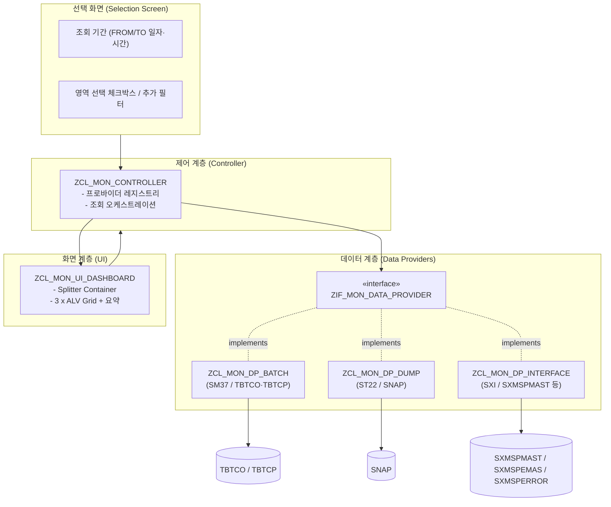

# 통합 운영 모니터링 프로그램 상세 설계서

| 항목 | 내용 |
|------|------|
| 문서명 | 통합 운영 모니터링 프로그램 (SM37 / ST22 / SXI_MONITOR) 상세 설계서 |
| 대상 시스템 | SAP S/4HANA (ABAP Integration Engine 사용) |
| 화면 환경 | SAP GUI (Classic Dynpro + OO ALV) |
| 문서 버전 | v0.1 (Draft) |
| 작성 목적 | ABAP 개발 착수 전 기능/데이터/화면/로직 확정을 위한 기술 설계 |
| 상태 | 검토 대기 (Review) |

> 본 문서는 **읽기 전용(Read-Only) 모니터링** 프로그램을 전제로 한다.
> 데이터 생성·수정·삭제 및 업데이트 트랜잭션 호출은 **전 영역에서 금지**한다.

---

## 목차

1. [개요](#1-개요)
2. [요구사항 정의](#2-요구사항-정의)
3. [전제 및 제약사항](#3-전제-및-제약사항)
4. [전체 아키텍처](#4-전체-아키텍처)
5. [데이터 소스 상세 설계](#5-데이터-소스-상세-설계)
6. [화면 설계](#6-화면-설계)
7. [처리 로직 설계](#7-처리-로직-설계)
8. [권한 및 보안 설계](#8-권한-및-보안-설계)
9. [성능 설계](#9-성능-설계)
10. [예외 및 에러 처리](#10-예외-및-에러-처리)
11. [개발 표준 및 오브젝트 목록](#11-개발-표준-및-오브젝트-목록)
12. [테스트 시나리오](#12-테스트-시나리오)
13. [향후 확장 방안](#13-향후-확장-방안)
14. [가정 및 미결 사항(Open Issues)](#14-가정-및-미결-사항open-issues)

---

## 1. 개요

### 1.1 목적
운영 담당자가 매일 수행하는 핵심 모니터링 업무를 **단일 프로그램(단일 트랜잭션)** 에서 통합 조회할 수 있도록 한다. 기존에는 다음 3개 표준 트랜잭션을 개별적으로 실행/조회해야 했다.

- **SM37** : 배치 잡(Background Job) 비정상 종료(에러) 모니터링
- **ST22** : ABAP 런타임 에러(Short Dump) 모니터링
- **SXI_MONITOR** : 인터페이스(PI/PO XML 메시지) 처리 에러 모니터링

본 프로그램은 위 3개 영역의 **에러 현황을 한 화면(대시보드)에서 동시에 가시화**하여, 운영 점검 시간을 단축하고 누락을 방지하는 것을 목적으로 한다.

### 1.2 범위
| 구분 | 포함(In-Scope) | 제외(Out-of-Scope) |
|------|----------------|--------------------|
| 기능 | 3개 영역의 에러 데이터 조회, 통합 대시보드 표시, 요약 카운트, 상세 드릴다운(표준 화면 호출) | 데이터 수정/재처리, 잡 재실행, 메시지 재전송, 알림/메일 발송 |
| 데이터 | 표준 테이블 직접 SELECT 및 표준 조회 FM | 커스텀(Z) 테이블, 외부 시스템 직접 연동 |
| 화면 | 단일 대시보드(3분할) + 선택 화면 | 웹/Fiori UI (본 단계는 SAP GUI 한정) |

### 1.3 대상 사용자
- 시스템 운영자 / 인프라 운영팀 / 인터페이스(PI) 운영 담당자

### 1.4 용어 정의
| 용어 | 설명 |
|------|------|
| 배치 잡 에러 | `TBTCO-STATUS = 'A'`(Cancelled/Aborted) 상태로 종료된 백그라운드 잡 |
| Short Dump | ABAP 런타임 에러로 인해 발생한 덤프(ST22에서 조회되는 항목) |
| 인터페이스 에러 | Integration Engine에서 처리 중 오류 상태로 종료된 XML 메시지 |
| 대시보드 | 3개 영역의 ALV를 한 화면에 분할 배치한 통합 조회 화면 |
| 데이터 프로바이더 | 각 모니터링 영역의 데이터를 조회하여 표준 출력 구조로 반환하는 모듈(클래스) |

---

## 2. 요구사항 정의

### 2.1 기능 요구사항(FR)
| ID | 요구사항 | 비고 |
|----|----------|------|
| FR-01 | 단일 프로그램에서 SM37/ST22/SXI 에러를 조회한다 | 단일 트랜잭션 코드 |
| FR-02 | 3개 영역을 하나의 대시보드 화면에 **동시 표시(3분할)** 한다 | 가시성 우선 |
| FR-03 | 화면 상단에 영역별 **에러 건수 요약 + 신호등 아이콘**을 표시한다 | 위험도 즉시 인지 |
| FR-04 | 조회 기간 기본값은 **현재시각 −24H ~ 현재시각** 으로 한다 | FR-05로 변경 가능 |
| FR-05 | 사용자가 조회 기간(일자/시간)을 **자유롭게 변경** 할 수 있다 | 월요일/명절 대응 |
| FR-06 | 각 라인 더블클릭 시 해당 표준 트랜잭션의 **상세 화면(읽기전용)** 으로 이동한다 | 드릴다운 |
| FR-07 | 영역별 조회 On/Off(체크박스)를 제공한다 | 부분 조회 |
| FR-08 | ALV 표준 기능(정렬/필터/합계/레이아웃 저장/엑셀 다운로드)을 지원한다 | 표준 ALV |

### 2.2 비기능 요구사항(NFR)
| ID | 요구사항 | 기준 |
|----|----------|------|
| NFR-01 | **읽기 전용** — 데이터 변경/업데이트/COMMIT/Enqueue 금지 | 필수 |
| NFR-02 | 표준 테이블/FM만 사용 | 필수 |
| NFR-03 | 기본 조회기간(24H) 응답 시간은 운영에 지장 없는 수준 | 인덱스 기반 조회 |
| NFR-04 | 향후 모니터링 영역 추가가 용이하도록 **모듈화(인터페이스 기반)** | 확장성 |
| NFR-05 | 권한 객체 기반 접근 통제 | 보안 |
| NFR-06 | 다국어 대응(텍스트 심볼/메시지 클래스 사용) | 국제화 |

---

## 3. 전제 및 제약사항

### 3.1 전제(Assumptions)
- 대상 시스템은 **S/4HANA** 이며, PI는 **ABAP Integration Engine(더블스택/내장 IE)** 을 사용하여 `SXMSPMAST` 등 PI 표준 테이블 접근이 가능하다.
- 배치 잡은 표준 `TBTCO`/`TBTCP` 테이블로 관리된다.
- ABAP 런타임 에러는 표준 `SNAP` 테이블에 저장된다.

### 3.2 제약사항(Constraints)
| 구분 | 제약 |
|------|------|
| 데이터 변경 금지 | `INSERT/UPDATE/MODIFY/DELETE`, `COMMIT WORK`, `ENQUEUE/DEQUEUE`, 업데이트성 BAPI/FM 호출 **전면 금지** |
| 트랜잭션 발생 금지 | 잡 재실행/메시지 재전송 등 **상태를 변경하는 행위 금지** |
| 표준 오브젝트만 | 데이터 원천은 표준 테이블/표준 조회 FM에 한정 |
| 드릴다운 | 상세 이동은 **표시(Display) 모드** 의 표준 화면/FM만 사용 |

> **읽기전용 보증 원칙**: 드릴다운으로 표준 트랜잭션을 호출하더라도, 호출 대상은 모니터링/조회용 화면이며 데이터 변경 기능을 트리거하지 않는다. (자세한 내용은 8장 참조)

---

## 4. 전체 아키텍처

### 4.1 설계 원칙
- **관심사 분리(Separation of Concerns)**: 데이터 조회 / 화면 표시 / 제어 로직을 분리한다.
- **인터페이스 기반 모듈화**: 영역별 데이터 조회를 공통 인터페이스로 추상화하여, **새로운 모니터링 영역 추가 시 신규 프로바이더 클래스만 구현** 하면 되도록 한다.
- **전략 패턴(Strategy)**: 컨트롤러는 등록된 데이터 프로바이더 목록을 순회하며 동일한 방식으로 호출한다.

### 4.2 논리 구성도

### 4.3 컴포넌트(클래스) 구성

| 컴포넌트 | 유형 | 책임 |
|----------|------|------|
| `ZIF_MON_DATA_PROVIDER` | Interface | 데이터 조회 표준 계약 정의 (`get_data`, `get_area_info`) |
| `ZCL_MON_DP_BATCH` | Class | SM37 배치 에러 조회 (`TBTCO`/`TBTCP`) |
| `ZCL_MON_DP_DUMP` | Class | ST22 덤프 조회 (`SNAP` / 표준 FM) |
| `ZCL_MON_DP_INTERFACE` | Class | SXI 인터페이스 에러 조회 (`SXMSPMAST` 외) |
| `ZCL_MON_CONTROLLER` | Class | 프로바이더 등록·실행, 결과 취합, 화면 연계 |
| `ZCL_MON_UI_DASHBOARD` | Class | Splitter/ALV 생성·이벤트 처리·드릴다운 |
| `ZCL_MON_NAVIGATOR` | Class | 영역별 표준 상세화면 호출(읽기전용) 캡슐화 |
| `Z_OPS_MONITOR` (Report) | Program | 선택화면 정의, INITIALIZATION, 컨트롤러 기동 |

> 초기 구현은 **하나의 실행형 리포트(`Z_OPS_MONITOR`)** 와 위 글로벌 클래스로 구성한다.
> 규모가 작을 경우 클래스를 리포트 내 로컬 클래스(LCL_*)로 둘 수도 있으나, **재사용·확장성을 위해 글로벌 클래스 권장**.

### 4.4 공통 인터페이스 계약(개념)

| 메서드 | 입력 | 출력 | 설명 |
|--------|------|------|------|
| `get_area_info` | - | 영역 코드/명/아이콘 | 요약 영역 표시에 사용 |
| `get_data` | 조회조건(기간/필터) | 표준 출력 테이블 + 건수 | 영역별 에러 데이터 반환 |
| `navigate_to_detail` | 선택 행 키 | - | 표준 상세화면(읽기전용) 호출 위임 |

> `navigate_to_detail`은 `ZCL_MON_NAVIGATOR`로 위임하여 화면 호출 로직을 일원화한다.
