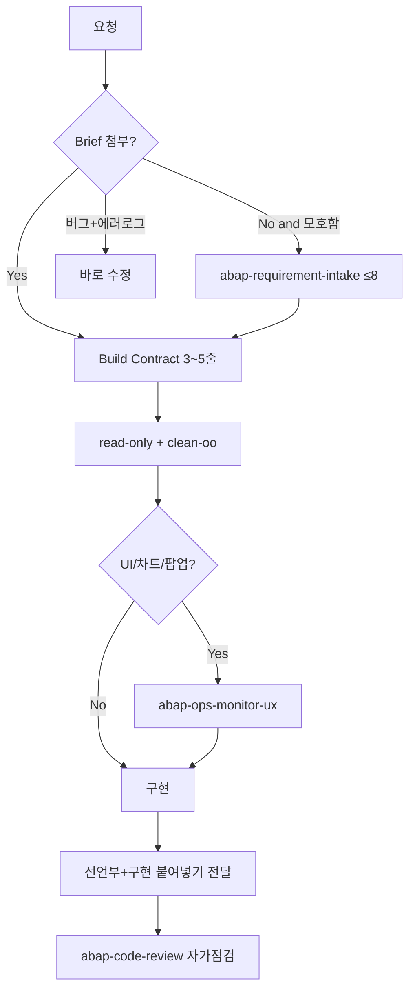

# 고퀄리티 ABAP을 최소 질문으로 받는 방법

## 결론 (추천)

**Brief 템플릿 + 선제 Intake 스킬 + UX 품질 스킬 + 전달(Delivery) 규칙**을
함께 쓰는 것이 최적입니다. 스킬만, 또는 질문만으로는 부족합니다.

| 수단 | 역할 | 없으면 생기는 일 |
|------|------|------------------|
| `docs/templates/ops-monitor-request-brief.md` | 사용자가 선호를 **한 번에** 고정 | 에이전트가 추측 → 다턴 수정 |
| `.cursor/skills/abap-requirement-intake` | Brief 없을 때 **질문 ≤8회**로 계약 | 모호한 요청이 즉시 저퀄 초안으로 감 |
| `.cursor/skills/abap-ops-monitor-ux` | “있어보이게”의 **구체 기준** 고정 | MESSAGE→HTML, IGS→HTML 등 재작업 |
| `.cursor/rules/abap-delivery-preferences.mdc` | SE38 붙여넣기·선언부 동시 제공 | `MO_* unknown`, GitHub 경로 실패 |
| 기존 read-only / clean-oo / review 스킬 | 안전·구조·검수 | 기능은 되나 운영 불변 깨짐 |

## 왜 이 조합이 최적인가

1. **품질의 대부분은 “취향”이 아니라 “이미 확정된 바”였다**  
   차트 HTML, 영역색, STATS/HELP 카드, ALV 툴바 최소화가 반복 수정으로
   합의됨 → 스킬에 고착하면 같은 루프가 사라짐.

2. **질문 수는 “많을수록 좋음”이 아니라 “앞단 1회”가 효율적**  
   세션 중 흘러나오는 취향 질문은 맥락 전환·재붙여넣기 비용을 키움.
   Intake는 한 메시지에 선택지를 모은다.

3. **전달 환경이 품질 루프를 키웠다**  
   GitHub 차단·통짜 소스·선언 누락은 UX와 무관한 턴을 양산.
   Delivery 규칙이 이를 상시 방지한다.

4. **사용자는 Brief만 채워도 Intake를 스킵**  
   숙련 사용자는 질문 0에 가깝게, 초보/모호 요청만 Intake가 보완.

## 권장 사용 흐름



### 사용자 쪽 (최소 프롬프트 예시)

```text
@docs/templates/ops-monitor-request-brief.md 채웠음.
HELP/STATS 팝업을 HTML 카드로, ECC, 붙여넣기 전달.
읽기전용 유지.
```

또는 더 짧게:

```text
Brief Default로 STATS KPI를 데모용 HTML 팝업으로 개선해줘.
```

## 이 세션에서 배운 숫자 (참고)

한 장기 세션 기준(동일 cloud agent run):

- 사용자 메시지 **약 107건**
- 그중 UX/기능 품질 루프 **약 절반**, 전달·발표자료·통짜 소스 등 **약 절반**
- 차트·STATS·HELP·ALV만 모아도 **약 25건** — 이 구간이 UX 스킬로 흡수 대상

목표 상태: 유사 UX 요청을 **Brief 0~1 + Intake 0~1 + 구현 1~2** 턴으로 수렴.
