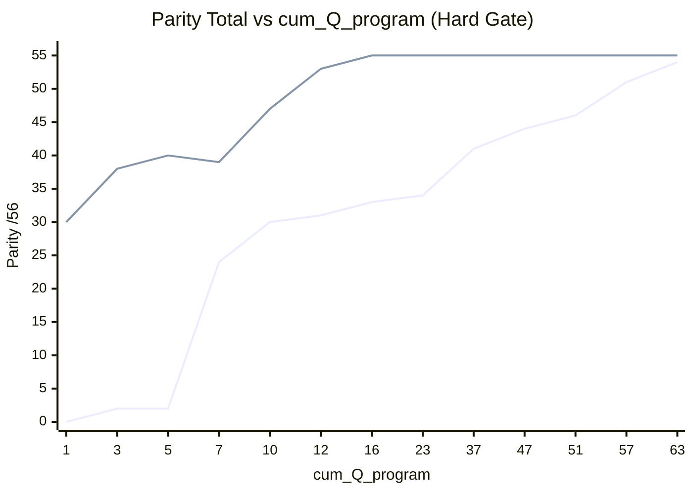

# Parity 점수 진화 vs 프로그램 관련 질문 수 — Session A vs B

| 항목 | 값 |
|------|-----|
| 작성일 | 2026-08-13 (Hard Gate 보정) |
| 채점 기준 | [`docs/guides/ops-monitor-parity-scoring.md`](../guides/ops-monitor-parity-scoring.md) (만점 56, PASS≥50 **+ 차단결함 없음**) |
| 최종 정렬 | [`parity-score-A-vs-B-2026-08.md`](./parity-score-A-vs-B-2026-08.md) — **최종 A=54 / B=55** |
| Transcript A | `bc-a0b7405d-…` (Awesome skills automation) |
| Transcript B | `bc-ec35fd1c-…` (통합 운영 모니터링 대시보드) |

> **보정 사유:** 이전 곡선은 B Q=1을 “코드 완성도”로 과대평가하고, 활성화 실패·팝업 X 불량·ST22 0건 등
> **알려진 동작 불능**이 있는 상태에서도 PASS에 가깝게 채점했다.  
> 본 개정은 **Hard Gate**(에러/미동작이 있으면 PASS 불가, 코드-only 천장 40)를 적용한다.  
> 중간 점수는 transcript 마일스톤 기반 추정치(±2). 최종행만 공식 채점과 정렬.

---

## 0. `cum_Q_program` · Hard Gate

| 제외 (축 미가산) | PPT/`계속`/메타 집계/순수 재붙여넣기 |
|------------------|-------------------------------------|

| 세션 | `cum_Q_program` 최종 |
|------|---------------------:|
| A | **63** |
| B | **16** |

**PASS = Total≥50 AND 차단 결함 0건 AND S2-06=2**  
차단 예: 활성화 빨강, 빈 화면, 팝업 X 불능, 필수 영역 조회 버그, 필수 드릴다운 불능.

---

## 1. Session A — 마일스톤 (Hard Gate 적용)

| cum_Q | milestone | S1 | S2 | S3 | S4 | Total | 차단 결함 | 등급 |
|------:|-----------|---:|---:|---:|---:|------:|-----------|------|
| 1 | 착수 | 0 | 0 | 0 | 0 | **0** | — | FAIL |
| 9 | 첫 스켈레톤 (미기동) | 10 | 8 | 2 | 4 | **24** | 미활성화·미기동 | FAIL |
| 15 | 첫 기동 (상단/차트=ALV) | 14 | 11 | 2 | 4 | **31** | (기동 OK) UX 미달 | FAIL |
| 23 | IGS 3차트 시도 | 16 | 10 | 4 | 4 | **34** | IGS API 활성화/동작 오류 | FAIL |
| 29 | 툴바·드릴·texts | 17 | 11 | 6 | 5 | **39** | 잔여 타입/드릴 이슈 | FAIL |
| 37 | Top-N·ST22 드릴 수정 중 | 18 | 11 | 7 | 5 | **41** | 덤프/타입 오류 루프 | FAIL |
| 47 | 데모 기능(텍스트 팝업) | 19 | 12 | 8 | 5 | **44** | IGS 색/방향 미동작 | FAIL |
| 51 | ECC 툴바 fcode 수정 | 19 | 12 | 10 | 5 | **46** | 차트 색 미적용 잔여 | PARTIAL |
| 57 | HTML 차트+색+스케일 | 20 | 12 | 14 | 5 | **51** | **없음** | **PASS** |
| 63 | HTML STATS/HELP | 20 | 12 | 16 | 6 | **54** | 없음 | **PASS** |

첫 PASS: **Q≈57** (알려진 IGS/툴바/타입 차단이 해소된 뒤).

---

## 2. Session B — 마일스톤 (Hard Gate 적용, 개정)

| cum_Q | milestone | S1 | S2 | S3 | S4 | Total | 차단 결함 | 등급 |
|------:|-----------|---:|---:|---:|---:|------:|-----------|------|
| 1 | 소스만 납품 (미실기) | 10 | 8 | 8 | 4 | **30** | 미활성화·미실기 (천장≤40) | FAIL |
| 2 | 문법 수정 직후 | 11 | 10 | 8 | 4 | **33** | 활성화 재시도 전/직후 불안정† | FAIL |
| 3 | Dynpro 가이드 | 12 | 12 | 8 | 6 | **38** | 팝업·ST22 실기 미검증 | FAIL |
| 5 | Selection texts | 12 | 12 | 8 | 8 | **40** | 동일 | FAIL |
| 6 | `GV_T_B1` 등 잔재 오류 | 12 | 10 | 8 | 7 | **37** | **활성화 오류** | FAIL |
| 7 | 팝업 X 수정 **전** 보고 | 13 | 12 | 6 | 8 | **39** | **팝업 닫기 불능** | FAIL |
| 7b | 팝업 X 수정 **후** | 13 | 12 | 12 | 8 | **45** | **ST22 목록 0건(버그)** | FAIL |
| 8–10 | UX 비율·시간축 | 14 | 12 | 13 | 8 | **47** | ST22 0건 잔존 | PARTIAL |
| 11 | HELP/STATS 메서드 누락 보고 | 14 | 10 | 10 | 8 | **42** | **활성화/심볼 오류** | FAIL |
| 12 | ST22 FM 시그니처·목록 복구 | 19 | 12 | 14 | 8 | **53** | **없음** | **PASS** |
| 14 | HTML 배경 문의 | 19 | 12 | 14 | 8 | **53** | 없음 | PASS |
| 16 | ST22 HTML 상세 (더블클릭) | 20 | 12 | 15 | 8 | **55** | 없음 | **PASS** |

† Q2: 문법 패치가 반영·재활성화된 뒤에야 S2-06=2. 표의 33은 “패치 직후·실기 확인 전” 보수값.

### B를 예전에 과대평가한 점

| 이전 (잘못) | 개정 (Hard Gate) |
|-------------|------------------|
| Q1 Total≈44, 곧 PASS권 | Q1=**30** FAIL (코드≠동작) |
| Q3에서 첫 PASS | 팝업X·ST22 버그로 **PASS 아님** |
| “처음부터 거의 완성” | 실제 첫 PASS = **ST22 복구 후 Q≈12** |

---

## 3. 동일 Q 체크포인트 (개정)

| cum_Q | A Total | A 등급 | B Total | B 등급 | Δ(B−A) |
|------:|--------:|--------|--------:|--------|-------:|
| 1 | 0 | FAIL | **30** | FAIL | +30 |
| 5 | ~2 | FAIL | **40** | FAIL | +38 |
| 10 | ~30 | FAIL | **47** | PARTIAL | +17 |
| 12 | ~31 | FAIL | **53** | **PASS** | +22 |
| 16 | ~33 | FAIL | **55** | PASS | +22 |
| 57 | **51** | PASS | — | — | — |
| 63 | **54** | PASS | — | — | — |

---

## 4. 효율 (개정)

| 구간 | A | B |
|------|--:|--:|
| 첫 PASS까지 Q | **57** | **12** |
| 첫 PASS Total / Q | 51/57 ≈ **0.89** | 53/12 ≈ **4.4** |
| 최종 Total / Q | 54/63 ≈ **0.86** | 55/16 ≈ **3.4** |

> 여전히 B가 빠르다. 다만 “Q=3에 PASS”가 아니라 **Q≈12에 차단 결함 해소 후 PASS**가 정직한 수치다.

---

## 5. 곡선 (mermaid, 개정)



```
Total
55 |                    B●────────────
53 |                 B●PASS@12
50 |                              A●PASS@57
40 |        B●
30 | B●        A●
 0 | A●
   +----+----+----+----+----+----> cum_Q
     1    5   12   30   57   63
```

---

## 6. 한계

1. 중간 점수는 턴 단위 전수 재채점이 아니라 결함 해소 시점 보간(±2).  
2. “데이터 진짜 0건” vs “조회 버그”는 대화상 ST22 공백 보고·이후 FM 수정으로 버그로 판정.  
3. 최종 A=54 / B=55 동등성 결론은 유지. **바뀐 것은 초반 곡선·첫 PASS 시점**이다.
